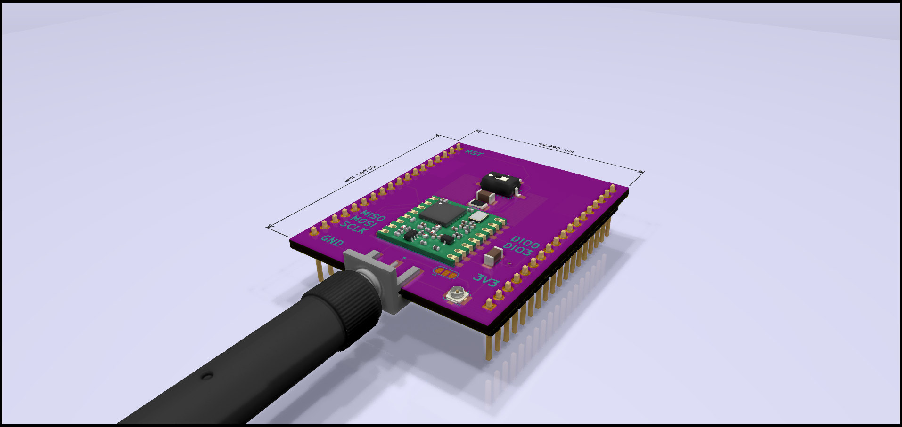

# LoRa Breakout board for the Zolertia RE-Mote Rev-B

## Schematics

## BOM

| Reference | Value           | Footprint                                                         | Datasheet                                                                     | Link                                                               |
|-----------|-----------------|-------------------------------------------------------------------|-------------------------------------------------------------------------------|--------------------------------------------------------------------|
| U1        | RFM95W-868S2    | RF_Module.pretty:HOPERF_RFM9XW_SMD                                | [rfm95](https://www.hoperf.com/data/upload/portal/20181127/5bfcbea20e9ef.pdf) | [rs](https://befr.rs-online.com/web/p/rf-modules/1251259/)         |
| J2        | Conn_Coaxial    | Connector_Coaxial.pretty:SMA_Amphenol_132289_EdgeMount            | ~                                                                             | [rs](https://befr.rs-online.com/web/p/coaxial-connectors/1440918/) |
| J3        | Conn_01x18_Male | Connector_PinHeader_2.54mm.pretty:PinHeader_1x18_P2.54mm_Vertical | ~                                                                             | [rs](https://befr.rs-online.com/web/p/pcb-headers/8281620/)        |
| J4        | Conn_Coaxial    | Connector_Coaxial.pretty:U.FL_Molex_MCRF_73412-0110_Vertical      | ~                                                                             | ~                                                                  |
| SW1       | SW_Push         | Button_Switch_SMD.pretty:SW_DIP_6.7x4.1mm_W8.61mm_P2.54mm         | ~                                                                             | ~                                                                  |
| C1        | 10uF            | Capacitor_SMD:C_1206_3216Metric_Pad1.33x1.80mm_HandSolder         | ~                                                                             | ~                                                                  |
| C2        | 1uF             | Capacitor_SMD:C_1206_3216Metric_Pad1.33x1.80mm_HandSolder         | ~                                                                             | ~                                                                  |
| R1        | 220R            | Resistor_SMD:R_1206_3216Metric_Pad1.30x1.75mm_HandSolder          | ~                                                                             | ~                                                                  |
| R2        | 10KR            | Resistor_SMD:R_1206_3216Metric_Pad1.30x1.75mm_HandSolder          | ~                                                                             | ~                                                                  |
## Credits

### 3D Models

* [Amphenol Right Angle Edge Mount SMA Connector](https://grabcad.com/library/amphenol-right-angle-edge-mount-sma-connector-1)
* [RFM95 LoRa Radio Module](https://grabcad.com/library/rfm95-lora-radio-module-1)
